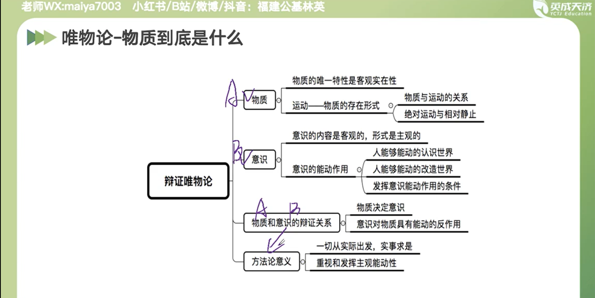
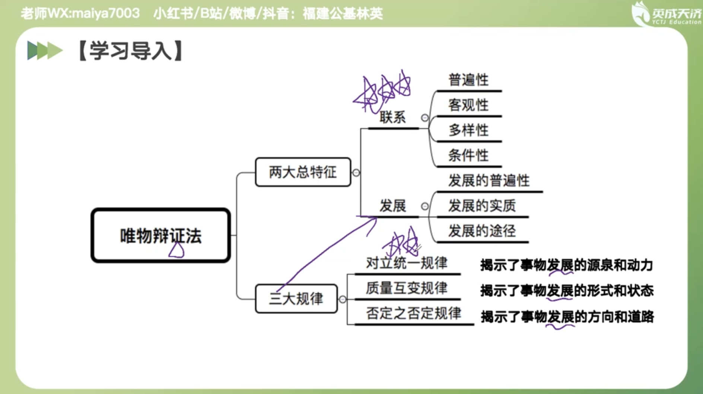
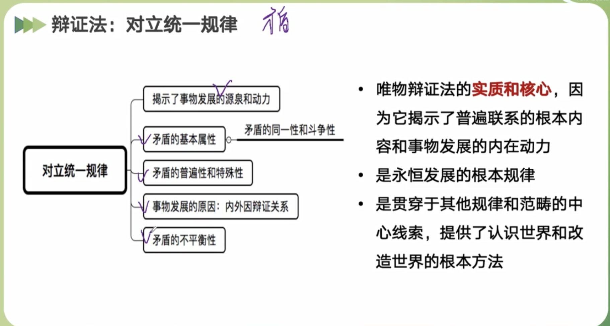
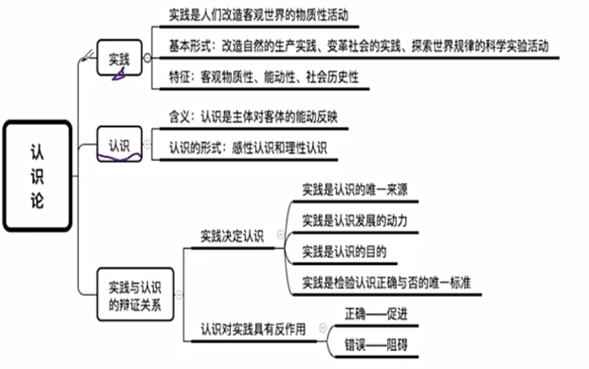
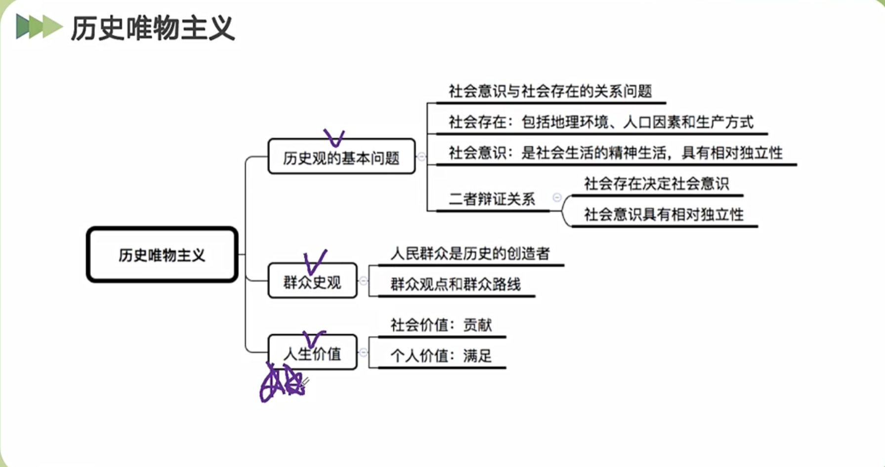
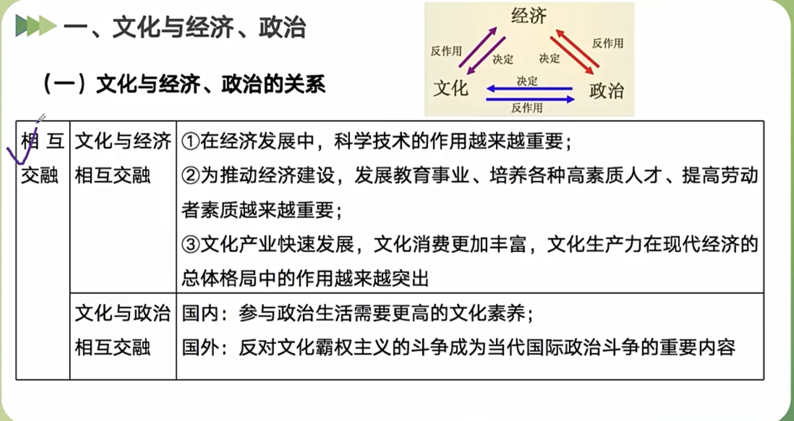
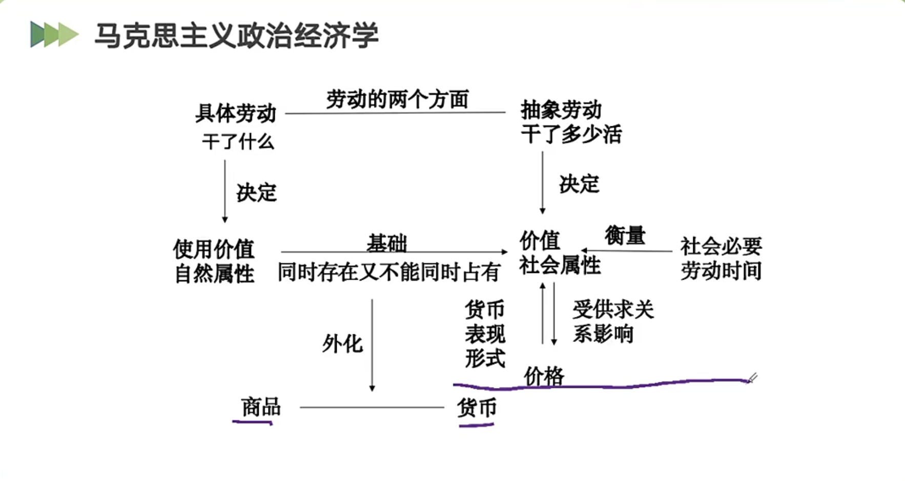
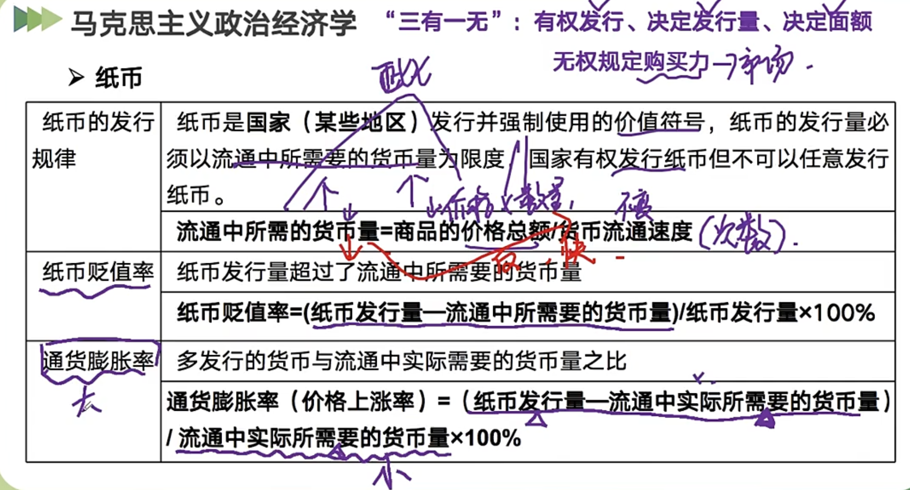
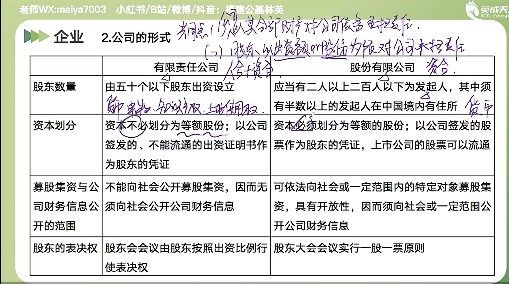

## [辩证唯物主义](https://zh.wikipedia.org/wiki/%E8%BE%A9%E8%AF%81%E5%94%AF%E7%89%A9%E4%B8%BB%E4%B9%89)（辩证唯物论）

物质和意识。

意识的目的是和实践结合，一起改造客观世界。

## [唯物辩证法](https://zh.wikipedia.org/wiki/%E5%94%AF%E7%89%A9%E8%BE%A9%E8%AF%81%E6%B3%95)

矛盾＝对立统一。

## 认识论

实践的观点是马哲首要的基本观点。

## 历史唯物主义

历史唯物主义认为：[生产力](https://zh.wikipedia.org/wiki/%E7%94%9F%E4%BA%A7%E5%8A%9B%E7%90%86%E8%AE%BA "生产力理论")和[生产关系](https://zh.wikipedia.org/wiki/%E7%94%9F%E4%BA%A7%E5%85%B3%E7%B3%BB "生产关系")之间的矛盾，[经济基础和上层建筑](https://zh.wikipedia.org/wiki/%E7%BB%8F%E6%B5%8E%E5%9F%BA%E7%A1%80%E5%92%8C%E4%B8%8A%E5%B1%82%E5%BB%BA%E7%AD%91 "经济基础和上层建筑")之间的矛盾，这是人类社会的基本矛盾。这两对矛盾存在于一切社会形态之中，贯穿于每一个社会形态的始终，决定着其他各种社会矛盾，是推动社会发展的基本动力，决定着社会历史的一般进程。

## 文化

## 经济学

## 市场主体：企业

